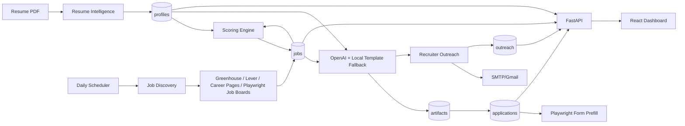

# Architecture

## Backend

- FastAPI serves profile, jobs, applications, artifacts, outreach, and dashboard APIs.
- SQLAlchemy persists data in PostgreSQL for Docker deployment.
- APScheduler runs morning discovery.
- Playwright handles browser-based discovery and application form prefill.
- OpenAI is used for resume tailoring, cover letters, recruiter messaging, and answers.

## Frontend

- React + Vite dashboard.
- Status lanes for New Jobs, Applied, Interviewing, Rejected, Offers, and Follow-ups.
- Job detail panel with score breakdown and generated material.
- Manual controls for actions that can have side effects.

## Safety Defaults

- Jobs below the threshold are skipped automatically.
- Outreach and application submission default to dry-run.
- Final application submission requires explicit opt-in through environment flags.

